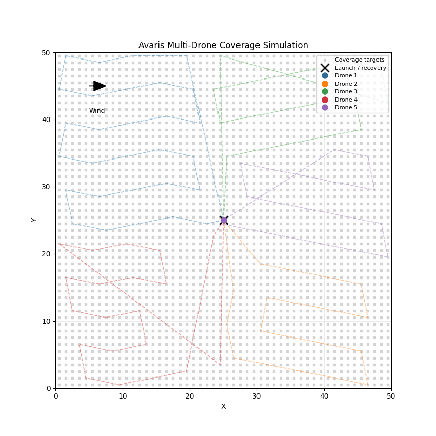

# Avaris

Avaris is a catastrophe-response prototype that models severe weather events over Bloomington, Illinois zoning data, prioritizes affected areas, plans drone swarm inspection routes, and demonstrates AI-assisted damage review.

This repo is a curated version of an older project. Abandoned experiments, generated outputs, machine-specific files, and bundled third-party source trees were removed; the remaining code was kept close to the original project while repairing the demo and routing logic.

## Web demo

The map is the main interface:

1. **Simulate** a tornado or severe-wind event over the loaded zoning area.
2. Avaris scores every zoning feature from modeled hazard proximity and land-use exposure.
3. Every affected zone (priority >= 0.75) becomes a required inspection target.
4. **Deploy** plans routes for the selected fleet and verifies complete coverage before launch.
5. Drones animate through their routes, affected zones change state as they are inspected, and drone progress updates in real time for each drone.
6. The **AI** panel shows how an inspection result may be presented to the user. Of course, this is merely a sample of scalable capabilites, but it is functional and can perform a live image assessment when the local demo server is run with an API key.

### Routing objectives

The route planner is heuristic, but it optimizes for the actual fleet-level goals of the demo rather than simply dividing the map into equal target counts:

- Start from compartmentalized geographic sectors to avoid unnecessary cross-town travel;
- Prefer critical/high-priority targets when they are within a small reasonable detour of the nearest available target;
- Improve same-priority route segments with bounded 2-opt;
- Estimate route completion from travel distance plus per-zone inspection time;
- Move lower-priority tail work from the projected slowest drone to under-loaded drones when doing so reduces fleet makespan without an excessive distance penalty;
- Verify that every affected zone appears exactly once before deployment.

The displayed completion estimate uses simple demo assumptions (42 km/h travel speed and 8 seconds scan time per zone), so route workloads can be compared consistently. These are simulation parameters, not operational flight specifications. For convenient practical implementation and improved scalability, parameters such as drone speed and sensor range can be easily tweaked in route_planner.py. 

### Run the full demo

Install dependencies, set your API key, then start the included Avaris server:

```bash
python -m pip install -r requirements.txt
python src/demo_server.py
```

Open `http://127.0.0.1:8000`.

For live image analysis, `OPENAI_API_KEY` must be present in the environment **before** the server starts. On PowerShell, for example:

```powershell
$env:OPENAI_API_KEY="your-key-here"
python src/demo_server.py
```

At startup the server prints either `Live AI: ready (...)` or `Live AI: disabled (...)`. The browser also checks `/api/status` before attempting a model request, so a static server can no longer fail with an unexplained HTTP 405.

The API key stays server-side; browser JavaScript never receives it. The local server accepts API requests only from localhost/127.0.0.1 origins.

If the server reports that `openai` is missing, install it with the **same Python executable that starts the server**. For example, if you launch with `C:\Python314\python.exe`, use:

```powershell
C:\Python314\python.exe -m pip install openai
```

Using plain `pip install openai` may install into a different Python installation. `/api/status` reports the active interpreter and whether the OpenAI package is available to it.

If you only want the map simulation, serving `web/` with a normal static HTTP server still works:

```bash
cd web
python -m http.server 8000
```

A static server cannot perform AI analysis. If you see the sample/preview UI but want **LIVE** results, stop the static server on port 8000 and run `python src/demo_server.py` instead. If the frontend is running on another local port (for example VS Code Live Server on 5500), Avaris will automatically look for its AI backend at `http://127.0.0.1:8000`.

The demo uses Leaflet and Turf from CDNs and OpenStreetMap tiles, so the map requires an internet connection.

## AI damage assessment

The AI panel has two modes:

- **SAMPLE** — the panel displays real NOAA National Geodetic Survey aerial imagery collected after Hurricane Helene, alongside clearly labeled deterministic sample output.
- **LIVE** — click **Analyze demo** to send the displayed NOAA image URL to the model, or **Upload image** to preview and analyze your own JPEG, PNG, or WebP while running `src/demo_server.py` with `OPENAI_API_KEY` set. The server returns a structured assessment containing damage level, confidence, concise findings, and a recommended review action. For future scalability, the assessment output should be more strictly structured using enumerated tags/values. 

Uploaded images are previewed in the panel before the request is made. If the live endpoint is unavailable, the uploaded image remains visible and the UI reports that it was not analyzed.

The demo reference image is NOAA National Geodetic Survey emergency-response imagery showing an individual destroyed property in Asheville, North Carolina after Hurricane Helene (2024). The image comes from NOAA's 2024 Hurricane Helene emergency-response imagery. NOAA lists that dataset as CC0-1.0/public-domain. Source image: https://oceanservice.noaa.gov/news/sep24/helene-asheville-oct-5-960.jpg ; dataset record: https://www.fisheries.noaa.gov/inport/item/73570/full-list

There is also a video-oriented prototype:

```bash
python src/video_damage_report.py path/to/video.mp4 --interval 10
```

It samples video frames, requests frame-level multimodal damage assessments, and combines those observations into a regional report.

## Standalone Python route simulation



Run:

```bash
python src/route_planner.py
```

For a headless/exported animation:

```bash
python src/route_planner.py --save route_demo.gif --no-show
```

The Python simulation is an older standalone routing prototype; the current Bloomington web demo uses the planner in `web/routing.js`.

## Routing smoke test

The routing module is intentionally independent of Leaflet so it can be exercised directly with Node:

```bash
node tests/routing_smoke.js
```

The smoke test creates 2,565 required stops and checks complete unique coverage, fleet finish-time balance, and early service of critical zones.

## Repository structure

```text
Avaris/
├── src/
│   ├── demo_server.py
│   ├── route_planner.py
│   └── video_damage_report.py
├── tests/
│   └── routing_smoke.js
├── web/
│   ├── index.html
│   ├── map.css
│   ├── priority_map.js
│   ├── routing.js
│   ├── assets/
│   │   ├── avaris_logo.png
│   │   └── route_planner_demo.gif
│   └── data/
│       └── bloomington_zoning.geojson
├── .gitignore
├── requirements.txt
└── README.md
```

## Data sources and attribution

* **Bloomington zoning boundaries** — McLean County GIS Consortium Open Data, *Zoning - City of Bloomington*. The repository includes a GeoJSON snapshot of this dataset for the simulation. Licensed under **CC BY 4.0**. Source catalog: https://geo.btaa.org/catalog/556fe4bb614e419bbc30ff31bdd9f3a3_19

* **AI demo imagery** — NOAA National Geodetic Survey emergency-response aerial imagery collected after Hurricane Helene (2024). The reference image used by the demo shows an individual damaged property in Asheville, North Carolina. NOAA identifies the associated dataset as **CC0-1.0/public-domain**. Source image: https://oceanservice.noaa.gov/news/sep24/helene-asheville-oct-5-960.jpg ; dataset record: https://www.fisheries.noaa.gov/inport/item/73570/full-list

* **Basemap data and tiles** — © OpenStreetMap contributors. OpenStreetMap data is made available under the **Open Database License (ODbL)**. Attribution is also displayed directly on the interactive map.

* **Web mapping libraries** — The browser demo uses the open-source **Leaflet** and **Turf.js** libraries, loaded from public CDNs. Leaflet is distributed under the BSD 2-Clause license; Turf.js is distributed under the MIT license.


## Scope

This is a historical prototype and portfolio project, not an operational flight, weather, structural-assessment, emergency-management, or insurance decision system. The incident model and SAMPLE assessment text are synthetic unless explicitly marked **LIVE**. The displayed NOAA reference image is real post-disaster aerial imagery and is labeled as such. The routing model does not account for real airspace, obstacles, battery reserves, communications, weather, or flight regulations.
